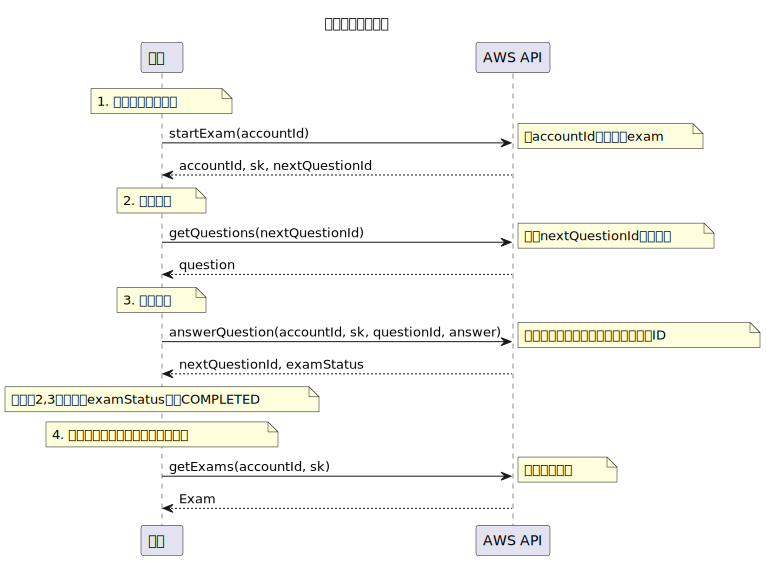

# Getting started

Dahua APIs，目前採用 [GraphQL](https://graphql.org/) 的技術，可以讓 Client 端比較有彈性的選擇需要什麼資料，可以避免資源浪費。
目前只有第一版本的考試 APIs，用來幫學生做分級測驗，預計未來會加上更多 APIs。

以下是 "分級測驗 API" 的流程圖。



## 測試機(dev) endpoint:

`https://bmxybfldb5bjdickj2z5gtm2ui.appsync-api.ap-southeast-1.amazonaws.com/graphql`

## 正式機(prod) endpoint:

`還沒架，預計明年初開始架` 😆

# Authentication

> To authorize, use below api key:

```graphql
{
  "x-api-key": "yourApiKey"
}
```

Dahua GraphQL API 要求每一個 request 必須要有未過期的 API KEY.

API KEY 每一年需要更新一次 (找 Wilson 拿 API KEY.)

`x-api-key: yourApiKey`

<aside class="notice">
You must replace <code>yourApiKey</code> with your API key.
</aside>

# Time

因為用戶可能來自世界各地，所以在這個系統中的所有 `startTime` 都是 [epoch timestamp](https://www.epochconverter.com/) 的形式 (例如 `1698117168`)，Client 端要再根據用戶的時區轉換時間。

# Exam

## Start Exam - Mutation

```graphql
mutation startExam {
  startExam(accountId: "test-accountId", examType: DETERMINE_LEVEL) {
    error
    message
    exam {
      accountId
      sk
      startTime
      nextQuestionNumber
      nextQuestionId
      status
      type
      remainingNumOfQuestion
      totalNumOfQuestion
      questionDetails
      achievedLevel
    }
  }
}
```

> 以上的 startExam mutation 會回傳以下 JSON:

```json
{
  "data": {
    "startExam": {
      "error": false,
      "message": "",
      "exam": {
        "accountId": "test-accountId",
        "sk": "exam:DETERMINE_LEVEL:ts:1698090652",
        "startTime": 1698090652,
        "nextQuestionNumber": 1,
        "nextQuestionId": "TOCFL1:HSK2:SA|1000000021",
        "status": "IN_PROGRESS",
        "type": "DETERMINE_LEVEL",
        "remainingNumOfQuestion": 3,
        "totalNumOfQuestion": 3,
        "questionDetails": null,
        "achievedLevel": "TOCFL1, HSK2"
      }
    }
  }
}
```

startExam mutation 會開啟一個新的考試，一個學生可以有多個考試。
開啟一個考試後，API 會回傳下一題的題目 ID(`nextQuestionId`)

考試狀態(`status`) 有 3 種(`IN_PROGRESS`, `COMPLETED`, `CANCELED`)

考試類型(`type`) 有 2 種(`DETERMINE_LEVEL`, `ESSAY`)

### Mutation Input Parameters

| Parameter            | type   | Description                                  |
| -------------------- | ------ | -------------------------------------------- |
| accountId (required) | string | 登入帳號 ID                                  |
| examType (required)  | enum   | 考試種類(目前只有`DETERMINE_LEVEL`跟`ESSAY`) |

<aside class="success">
注意 — examType 是 GraphQL enum type
</aside>

### Response

| Parameter              | type    | Description                                              |
| ---------------------- | ------- | -------------------------------------------------------- |
| startTime              | string  | 登入帳號 ID                                              |
| nextQuestionNumber     | Int     | 下一題的題號 (1, 2, 3, 4...)                             |
| nextQuestionId         | string  | 下一題的題目 ID                                          |
| status                 | enum    | 考試狀態(目前只有`IN_PROGRESS`, `COMPLETED`, `CANCELED`) |
| type                   | enum    | 考試種類(目前只有`DETERMINE_LEVEL`, `ESSAY`)             |
| remainingNumOfQuestion | Int     | 當前測驗剩下題數                                         |
| totalNumOfQuestion     | Int     | 當前測驗總共的題數                                       |
| questionDetails        | AWSJSON | 當前測驗的考試細節，包含學生選擇的答案與正確答案         |
| achievedLevel          | string  | 學生達到的程度                                           |

## Questions - Query

```graphql
query questions {
  questions(questionId: "TOCFL1:HSK2:SA|1000000021") {
    questions {
      levelId
      level
      sk
      HSKLevel
      questionId
      TocflLevel
      question
      reference
      source
      type
      options
    }
    error
    message
  }
}
```

> 以上的 questions query 會回傳以下 JSON:

```json
{
  "data": {
    "questions": {
      "questions": [
        {
          "levelId": "TOCFL1:HSK2:SA",
          "level": "TOCFL1, HSK2",
          "sk": "1000000021",
          "HSKLevel": "2",
          "questionId": "TOCFL1:HSK2:SA|1000000021",
          "TocflLevel": "1",
          "question": "这种鱼___年春天最多，男人们会一起搭船去海上找鱼。",
          "reference": "这种鱼___年春天最多，男人们会一起搭船去海上找鱼。",
          "source": "TOCFL考題",
          "type": "SA",
          "options": "{\"A\":\"没有\",\"B\":\"每\",\"C\":\"几\"}"
        }
      ],
      "error": false,
      "message": ""
    }
  }
}
```

Questions query API 可以根據 input parameters 回傳一個或是多個考題，如果有收到`questionId` 的話就只會回傳一個考題。

### Query Input Parameters

| Parameter             | type   | Description                                                       |
| --------------------- | ------ | ----------------------------------------------------------------- |
| questionId (required) | string | 考題 ID，這是唯一的                                               |
| levelId (optional)    | string | 程度 ID (必須配合 `sk` 或是 (`skFrom` + `skTo`))                  |
| sk (optional)         | string | sort key，每一個程度會有多個 sort key，代表每一個程度會有多個考題 |
| skFrom (optional)     | string | 起始 sort key                                                     |
| skTo (optional)       | string | 最終 sort key                                                     |

<aside class="warning">目前暫時不用理會 <code>levelId</code>, <code>sk</code>, <code>skFrom</code>, <code>skTo</code> (正在開發中...)</aside>

### Response

| Parameter  | type    | Description                                      |
| ---------- | ------- | ------------------------------------------------ |
| levelId    | string  | 考題的程度 Id                                    |
| sk         | string  | 考題的 sort key                                  |
| level      | string  | 考題的程度 (`TOCFL1, HSK2`)                      |
| HSKLevel   | string  | HSK 程度                                         |
| TocflLevel | string  | Tocf 程度                                        |
| questionId | string  | 考題 ID，這是唯一的                              |
| reference  | string  | 當前測驗總共的題數                               |
| source     | string  | 當前測驗的考試細節，包含學生選擇的答案與正確答案 |
| type       | enum    | 考題的總類，目前有(單選題`SA`, 多選題`MA`)       |
| options    | AWSJSON | 這是一個包含所有選項的 JSON                      |

## Answer Question - Mutation

```graphql
mutation answerQuestion {
  answerQuestion(
    accountId: "test-accountId"
    sk: "exam:DETERMINE_LEVEL:ts:1698090652"
    questionId: "TOCFL1:HSK2:SA|1000000021"
    studentAnswers: ["A"]
  ) {
    nextQuestionId
    remainingNumOfQuestion
    nextLevel
    achievedLevel
    examStatus
    message
    error
  }
}
```

> 以上的 answerQuestion mutation 會回傳以下 JSON:

```json
{
  "data": {
    "answerQuestion": {
      "nextQuestionId": "TOCFL1:HSK2:SA|1000000017",
      "remainingNumOfQuestion": 2,
      "nextLevel": "TOCFL1, HSK2",
      "achievedLevel": "TOCFL1, HSK2",
      "examStatus": "IN_PROGRESS",
      "message": "",
      "error": false
    }
  }
}
```

> 測驗結束的 Response 如下：

```json
{
  "data": {
    "answerQuestion": {
      "nextQuestionId": "",
      "remainingNumOfQuestion": 0,
      "nextLevel": "",
      "achievedLevel": "TOCFL1, HSK2",
      "examStatus": "COMPLETED",
      "message": "",
      "error": false
    }
  }
}
```

Answer Question mutation 可以讓學生回答考題。
每一次的 API call 都會回傳下一題的題目 ID (`nextQuestionId`) 與測驗狀態 (`examStatus`)，當 `nextQuestionId` 等於空字串(`""`) 並且 `examStatus` 等於 `COMPLETED`，代表測驗結束，並且最終程度 (`achievedLevel`) 就是學生的程度。

### Mutation Input Parameters

| Parameter      | type            | Description     |
| -------------- | --------------- | --------------- |
| accountId      | string          | 登入帳號 ID     |
| sk             | string          | 考試的 sort key |
| questionId     | string          | 題目 ID         |
| studentAnswers | Array of String | 學生的答案      |

### Response

| Parameter              | type   | Description      |
| ---------------------- | ------ | ---------------- |
| nextQuestionId         | string | 下一題考題的 Id  |
| remainingNumOfQuestion | Int    | 當前測驗剩下題數 |
| nextLevel              | string | 下一題考題的難度 |
| achievedLevel          | string | 學生達到的程度   |
| examStatus             | enum   | 當前測驗的狀態   |

## Exams - Query

```graphql
query exams {
  exams(accountId: "test-accountId", withDetails: false) {
    error
    message
    exams {
      accountId
      sk
      nextQuestionId
      questionDetails
      remainingNumOfQuestion
      startTime
      status
      totalNumOfQuestion
      achievedLevel
      type
    }
  }
}
```

> 以上的 exams query 會回傳以下 JSON:

```json
{
  "data": {
    "exams": {
      "error": false,
      "message": "",
      "exams": [
        {
          "accountId": "test-accountId",
          "sk": "exam:DETERMINE_LEVEL:ts:1698090545",
          "nextQuestionId": null,
          "questionDetails": null,
          "remainingNumOfQuestion": null,
          "startTime": 1698090545,
          "status": "COMPLETED",
          "totalNumOfQuestion": null,
          "achievedLevel": null,
          "type": "DETERMINE_LEVEL"
        },
        {
          "accountId": "test-accountId",
          "sk": "exam:DETERMINE_LEVEL:ts:1698090652",
          "nextQuestionId": null,
          "questionDetails": null,
          "remainingNumOfQuestion": null,
          "startTime": 1698090652,
          "status": "COMPLETED",
          "totalNumOfQuestion": null,
          "achievedLevel": null,
          "type": "DETERMINE_LEVEL"
        }
      ]
    }
  }
}
```

> 如果 withDetails 是 true 的話，會回傳以下 JSON：

```json
{
  "data": {
    "exams": {
      "error": false,
      "message": "",
      "exams": [
        {
          "accountId": "test-accountId",
          "sk": "exam:DETERMINE_LEVEL:ts:1698090545",
          "nextQuestionId": "",
          "questionDetails": "{\"1\":{\"sk\":\"1000000002\",\"correctAnswers\":[\"A\"],\"studentAnswers\":[\"A\"],\"level\":\"TOCFL1, HSK2\",\"levelId\":\"TOCFL1:HSK2:SA\",\"isCorrect\":true},\"2\":{\"sk\":\"1000000013\",\"correctAnswers\":[\"B\"],\"studentAnswers\":[\"A\"],\"level\":\"TOCFL1, HSK2\",\"levelId\":\"TOCFL1:HSK2:SA\",\"isCorrect\":false},\"3\":{\"sk\":\"1000000004\",\"correctAnswers\":[\"A\"],\"studentAnswers\":[\"A\"],\"level\":\"TOCFL1, HSK2\",\"levelId\":\"TOCFL1:HSK2:SA\",\"isCorrect\":true},\"consecutiveWrong\":0,\"consecutiveCorrect\":1}",
          "remainingNumOfQuestion": 0,
          "startTime": 1698090545,
          "status": "COMPLETED",
          "totalNumOfQuestion": 3,
          "achievedLevel": "TOCFL1, HSK2",
          "type": "DETERMINE_LEVEL"
        },
        {
          "accountId": "test-accountId",
          "sk": "exam:DETERMINE_LEVEL:ts:1698090652",
          "nextQuestionId": "",
          "questionDetails": "{\"1\":{\"sk\":\"1000000021\",\"correctAnswers\":[\"B\"],\"studentAnswers\":[\"A\"],\"level\":\"TOCFL1, HSK2\",\"levelId\":\"TOCFL1:HSK2:SA\",\"isCorrect\":false},\"2\":{\"sk\":\"1000000017\",\"correctAnswers\":[\"A\"],\"studentAnswers\":[\"A\"],\"level\":\"TOCFL1, HSK2\",\"levelId\":\"TOCFL1:HSK2:SA\",\"isCorrect\":true},\"3\":{\"sk\":\"1000000002\",\"correctAnswers\":[\"A\"],\"studentAnswers\":[\"A\"],\"level\":\"TOCFL1, HSK2\",\"levelId\":\"TOCFL1:HSK2:SA\",\"isCorrect\":true},\"consecutiveWrong\":0,\"consecutiveCorrect\":0}",
          "remainingNumOfQuestion": 0,
          "startTime": 1698090652,
          "status": "COMPLETED",
          "totalNumOfQuestion": 3,
          "achievedLevel": "TOCFL1, HSK2",
          "type": "DETERMINE_LEVEL"
        }
      ]
    }
  }
}
```

Exam query 可以根據 input parameters 回傳學生的 "一個" 或 "多個" 考題歷史紀錄。

1.  當你只提供 `accountId` 的情況下，Exam API 會回傳這個登錄帳號下 "所有" 的測驗歷史紀錄。
2.  當你提通 `accountId` + `sk` 的情況下，Exam API 會回傳這個登錄帳號下 "一個" 測驗記錄。

比較建議的做法是，可以先不傳`withDetails`(預設為`false`)，並且拿到學生的多個測驗歷史後，在讓學生點選某一個測驗，這時候在把 `withDetails`設定為`true` 並且傳(`accountId` + `sk`(學生選中的 sk))給 Exam API，這時 Exam API 就會把所有測驗細節回傳給學生。

### Mutation Input Parameters

| Parameter                  | type    | Description                                  |
| -------------------------- | ------- | -------------------------------------------- |
| accountId (required)       | string  | 登入帳號 ID                                  |
| sk (optional)              | string  | 測驗的 sort key                              |
| examType (optional)        | enum    | 考試種類(目前只有`DETERMINE_LEVEL`跟`ESSAY`) |
| withDetails (預設為 false) | boolean | 學生的答案                                   |

<aside class="success">
 <code>withDetails</code> 預設為 <code>false</code> (API 響應速度較快)，當需要取得學生的作答記錄時，在把 <code>withDetails</code> 設定為 <code>true</code>。
</aside>

### Response

| Parameter              | type    | Description                                      |
| ---------------------- | ------- | ------------------------------------------------ |
| accountId              | string  | 登入帳號 ID                                      |
| sk                     | string  | 測驗的 sort key                                  |
| nextQuestionId         | string  | 下一題考題的 Id                                  |
| questionDetails        | AWSJSON | 當前測驗的考試細節，包含學生選擇的答案與正確答案 |
| remainingNumOfQuestion | Int     | 當前測驗剩下題數                                 |
| startTime              | Int     | 當前測驗的開始時間                               |
| status                 | enum    | 當前測驗的狀態                                   |
| totalNumOfQuestion     | Int     | 當前測驗總共的題數態                             |
| achievedLevel          | String  | 學生達到的程度                                   |
| type                   | enum    | 當前測驗的種類                                   |

## Cancel Exam - Mutation

開發中 🛠️ ～～ 以後再補上
